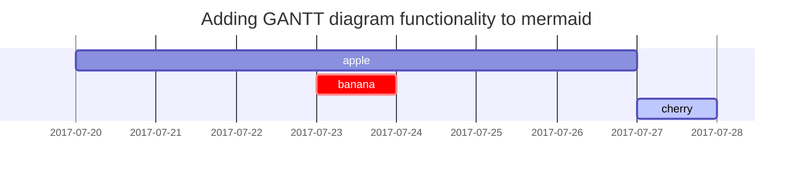

## Key Achievements of this Week:(Working hours:50)

| Task                         | Time Investment  | Status  |
|:-----------------------------|:-----------------|--------:|
| 1st Year Annual Review       | 35/40            | 87.5%   |
|  Carbon Calculation Training (City-level Database Provided) | 3/40 | 7.5%    |
| Preparation of 4th Version of TSu BP     | 2/40 | 5%      |
| Personal Website Construction| 10 hours more    | +25%    |


### Research Progress
The progress report focuses on multi-scale electrolysis energy system modeling,emphasizing two main areas: system level operational dynamics optimization using Generative Adversarial Networks (GANs) and cell level descriptor database analysis. 

Annual Review: Paper 1

The first section outlines the use of GANs to augment data for optimizing the operational dynamics of an electrolysis system, highlighting the process of generating synthetic data to overcome the limitations of small sample sizes and enhance model training.

<div style="float: right; width: 50%;">
    
</div>

_A visual representation of the process of using Generative Adversarial Networks (GANs) to generate synthetic data for enhancing the training of models within an electrolysis energy system_


Annual Review : Paper 2
: The second section delves into the development of a comprehensive database for proton exchange membrane water electrolysis (PEMWE), using machine learning to predict membrane electrode assembly performance, showcasing the application of data science in improving electrolysis efficiency and reliability. This approach underscores the importance of integrating advanced computational techniques in renewable energy research to achieve significant strides in hydrogen production technology.

{: width="972" height="589" .w-50 .right}
_A visual representation of the process of using Generative Adversarial Networks (GANs) to generate synthetic data for enhancing the training of models within an electrolysis energy system_


# H1 - heading
{: .mt-4 .mb-0 }

## H2 - heading
{: data-toc-skip='' .mt-4 .mb-0 }

### H3 - heading
{: data-toc-skip='' .mt-4 .mb-0 }

#### H4 - heading
{: data-toc-skip='' .mt-4 }

## Paragraph

Quisque egestas convallis ipsum, ut sollicitudin risus tincidunt a. Maecenas interdum malesuada egestas. Duis consectetur porta risus, sit amet vulputate urna facilisis ac. Phasellus semper dui non purus ultrices sodales. Aliquam ante lorem, ornare a feugiat ac, finibus nec mauris. Vivamus ut tristique nisi. Sed vel leo vulputate, efficitur risus non, posuere mi. Nullam tincidunt bibendum rutrum. Proin commodo ornare sapien. Vivamus interdum diam sed sapien blandit, sit amet aliquam risus mattis. Nullam arcu turpis, mollis quis laoreet at, placerat id nibh. Suspendisse venenatis eros eros.

## Lists

### Ordered list

1. Firstly
2. Secondly
3. Thirdly

### Unordered list

- Chapter
  + Section
    * Paragraph

### ToDo list

- [ ] Job
  + [x] Step 1
  + [x] Step 2
  + [ ] Step 3

### Description list

Sun
: the star around which the earth orbits

Moon
: the natural satellite of the earth, visible by reflected light from the sun

## Block Quote

> This line shows the _block quote_.

## Prompts

> An example showing the `tip` type prompt.
{: .prompt-tip }

> An example showing the `info` type prompt.
{: .prompt-info }

> An example showing the `warning` type prompt.
{: .prompt-warning }

> An example showing the `danger` type prompt.
{: .prompt-danger }

## Tables

| University                   | Reference        | Country |
|:-----------------------------|:-----------------|--------:|
| Massachusetts Institute of Technology| Pulkit Agrawal| US |
| University of Warwick        | Sai Gu           | UK      |
| University of Birmingham     | Leandro Minku    | UK      |
| University of Nottingham     | Gavin Walker     | UK      |
| Southeast University         | Mingchun Wang    | China   |

## Links

<http://127.0.0.1:4000>

## Footnote

Click the hook will locate the footnote[^footnote], and here is another footnote[^fn-nth-2].

## Inline code

This is an example of `Inline Code`.

## Filepath

Here is the `/path/to/the/file.extend`{: .filepath}.

## Code blocks

### Common

```
This is a common code snippet, without syntax highlight and line number.
```

### Specific Language

```bash
if [ $? -ne 0 ]; then
  echo "The command was not successful.";
  #do the needful / exit
fi;
```

### Specific filename

```sass
@import
  "colors/light-typography",
  "colors/dark-typography";
```
{: file='_sass/jekyll-theme-chirpy.scss'}

## Mathematics

The mathematics powered by [**MathJax**](https://www.mathjax.org/):

$$ \sum_{n=1}^\infty 1/n^2 = \frac{\pi^2}{6} $$

When $a \ne 0$, there are two solutions to $ax^2 + bx + c = 0$ and they are

$$ x = {-b \pm \sqrt{b^2-4ac} \over 2a} $$

## Mermaid SVG




## Video



## Reverse Footnote

[^footnote]: The footnote source
[^fn-nth-2]: The 2nd footnote source


